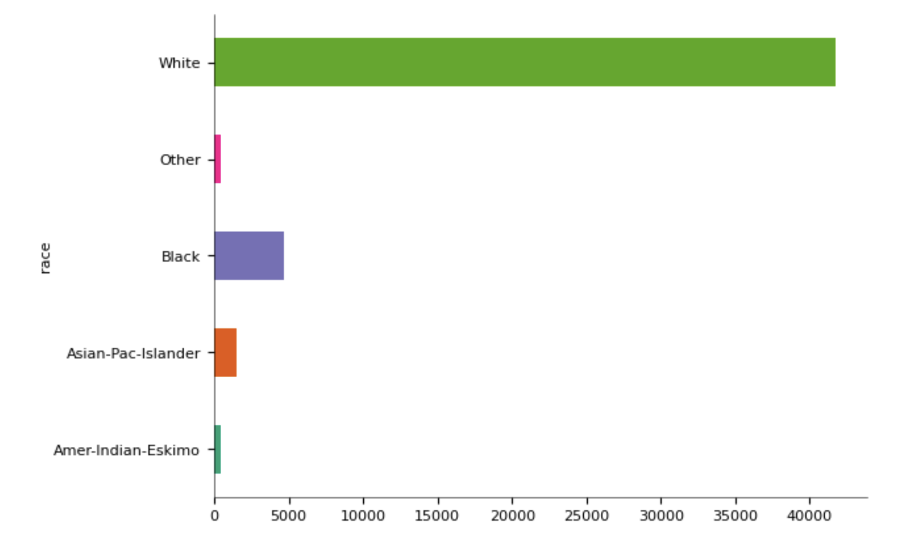
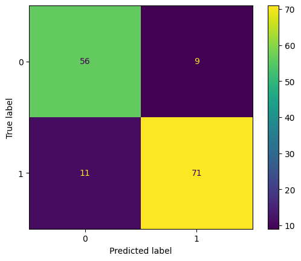
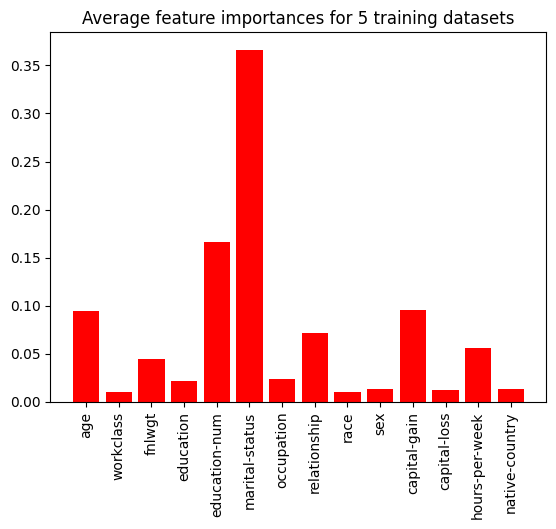
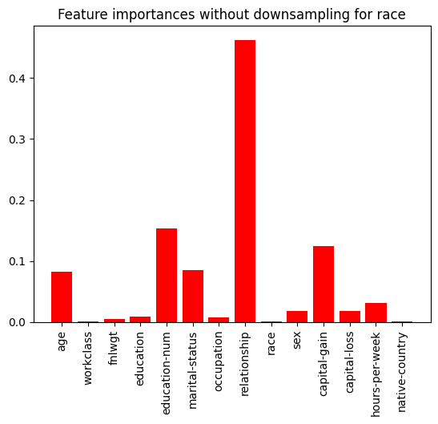

## Investigating American Adult Income with Decision Trees

I applied machine learning techniques to investigate the demographic factors most closely associated with personal income for a dataset of American adults. My code can be found at:
https://colab.research.google.com/drive/1kZJieswbBIOGf-One315Nhtnp_KrzMlI?usp=sharing
Below is my report.

***

## Introduction 

For this problem, I chose to use the “Adult” dataset from the UC Irvine Machine Learning Repository[1]. This dataset is composed of 15 common demographic factors for 48,842 adults surveyed in the 1994 US Census. The 14 features in this dataset include age, education level, race, sex, occupation, marital-status, among others. The target is a binary variable specifying whether an individual makes over $50,000 per year or not. The goal with this dataset was to predict whether an individual made more than $50,000 annually based on the 14 census variables.

This dataset naturally lends itself to a binary classification problem, and since the target variable is known (income level), I chose to use a supervised machine learning model. More specifically, I wanted to apply decision trees to this problem, as their property of being a whitebox machine learning algorithm meant that I could gain more valuable insights about the dataset’s features and analyze their relative importance in predicting the target variable. In other words I wanted to explore the question: What demographic factors are most influential in determining an American adult’s income?

To solve this problem, I trained three types of decision tree based models from the scikit-learn Python library: a single decision tree, a random forest model with 100 estimators, and a boosting random forest model with 100 classifiers. After testing, I found that the single decision tree had the best accuracy rate and f1-score of 0.821 and 0.829, respectively, though both of the other models were not far behind, also close to 0.8 for both metrics. After conducting feature ranking on each of the models, I found that the most influential features in the models were marital status, number of years of education, age, and capital gains. However, I fell short of making any broad conclusions about the influence of these demographic features on an individual's income due to the large influence of sample selection on these models.

## Data

| Name | Role | Type |
| --- | --- | --- |
| age | Feature | Integer |
| workclass | Feature | Categorical |
| fnlwgt | Feature | Integer |
| education | Feature | Categorical |
| education-num | Feature | Integer |
| marital-status | Feature | Categorical |
| occupation | Feature | Categorical |
| relationship | Feature | Categorical |
| race | Feature | Categorical |
| sex | Feature | Binary |
| capital-gain | Feature | Integer |
| capital-loss | Feature | Integer |
| hours-per-week | Feature | Integer |
| native-country | Feature | Categorical |
| income | Target | Binary |

*Table 1: Summary of the variables in the dataset.*

The Adult dataset includes 14 features and the target variable “income” for 48,842 American adults. Table 1 shows all of the variables included in the dataset, as well as the type of data (binary, categorical, numeric) of each feature. As far as data preprocessing, one small issue that came up was that when reading the data into Google Colab, the target variable “income” was being detected as having four categories, with some of the values ending in commas while others do not (for example, “>50K,” vs. “>50K”). This required a simple fix of removing all of the commas in this field with string manipulation functions, after which Python was able to detect “income” as a binary variable. This was done with the code below:

```python
y['income'] = y['income'].str.replace('.', '')
mapping_dict = {'>50K': 1, '<=50K': 0}
y['income'] = y['income'].replace(mapping_dict) #turn target values into binary
```

The largest data preprocessing step taken in this project involved balancing the target variable. More specifically, around 76% of the records in the original dataset had annual incomes less than or equal to $50,000, so a machine learning model trained on that dataset would be at risk of having a bias towards predicting that value. To eliminate this risk, the “<=50K” income category was downsampled so that there were equal numbers of samples with incomes “>50K” and “<=50K”. This involved randomly selecting “>50K” income records to be included in the new dataset, as done in the code chunk below. 

This method can also be used to correct imbalances in the feature variables, which I did explore for the “race” feature. This involved subsetting the data for each race category, and randomly downsampling them all to the size of the category with the least number of samples, as seen below. Given that over 80% of the data falls into the “White” race category (see Figure 1), this step significantly reduced the size of the data to under 600 samples for the training dataset. Though, this smaller training dataset introduces more variability in the models, which I will explore further in the discussion section of this report.



*Figure 1: Number of samples in original Adult dataset according to "race" feature.*

Another data preprocessing step undertaken was the separation of training and testing datasets, which was done with scikit-learn’s train_test_split() function, as seen in the code chunk below[2]. I assigned 80% of the data into the training dataset and 20% of the data into the testing dataset. This is a crucial step, as having a separate testing dataset that the model isn’t trained on means that we can accurately test the model’s performance and avoid overfitting.

```python
X_train, X_test, y_train, y_test = train_test_split(X, y, test_size=0.2, random_state=42)
```

## Modeling

Decision trees are a versatile supervised learning model that can be used for both classification and regression problems. At its core, the decision tree algorithm attempts to create logical pathways for predicting the target variable by “splitting” entries based on their feature values. The decision tree algorithm used in this model splits on the feature with the lowest Gini impurity, which is a measure of the likelihood that an observation is incorrectly classified. Decision trees were chosen for this model primarily because of their intuitive nature and structure. The splits that the algorithm chooses to make are indicative of the relative influences of each feature on the target variable, which allows us to make greater insights into what demographic factors have the largest influence on an individual’s income. More specifically, decision trees include a metric called feature importance, which measures each feature’s contribution to the final predictions made by the model. These values can also be used to filter out extraneous features to construct a more refined model, though the dataset in this problem has few enough features that doing that here is somewhat unnecessary. The first model I trained was a single decision tree with a maximum depth (number of layers/splits) of 5.

In addition to a base decision tree model, I constructed two decision tree models that also use ensemble methods, namely a random forest and boosting. A random forest trains a large number of decision trees (100 in the case of my model) and aggregates their results to create a better prediction. Finally, I trained a boosting model, also with 100 estimators. Boosting is similar to a random forest in that it is composed of many decision trees, but it differs in that the model goes through multiple iterations of training, with each subsequent iteration focusing on the samples that the previous model misclassified, in a way correcting for the past model’s weaknesses. Both of these ensemble methods used trees with a maximum depth of 2, which can be that low because of the large number of estimators involved in the model.

Each of these three models was trained using a function from the scikit-learn library, namely DecisionTreeClassifier, RandomForestClassifier, and GradientBoostingClassifier[2]. These functions handle all of the calculations involved in training the models, so on my part I simply had to input my training dataset into each model and set the chosen model parameters, as seen with the code for a single decision tree below:

```python
from sklearn.tree import DecisionTreeClassifier
from sklearn import tree

max_depth = 5
tree = DecisionTreeClassifier(max_depth = max_depth)
tree.fit(X_train, y_train)
y_pred_tree = tree.predict(X_test)
```

The code for the random forest model and boosting model was structured similarly. After training the models, they were each used to predict the target variables for the testing dataset. These predictions were then compared with the true target values from the testing dataset by calculating an accuracy score (the rate of getting predictions correct) and a f1-score (a more complex metric that seeks to balance precision and true positive rate). Finally, the scikit-learn functions all calculate the attribute feature_importances_, which gives an indication of the relative contribution of each feature in the model predictions. 

Due to the relatively small training dataset and the use of random sampling to balance the race feature and income target variable, the models can produce slightly different results each time we train them. To account for this, I trained each model type five times and collected the accuracy score, f1-score, and feature importances for each training cycle. The accuracy and f1-scores are summarized in Table 2 and 3 below.

| Training Run | Decision Tree | Random Forest | Boosting |
| --- | --- | --- | --- |
| 1 | 0.864 |	0.823 | 0.782 |
| 2 | 0.799 |	0.805 |	0.844 |
| 3 | 0.821 |	0.775 |	0.795 |
| 4 | 0.836 |	0.829 |	0.816 |
| 5 | 0.784 |	0.734 |	0.755 |
| Mean | 0.821 |	0.793 |	0.798 |

*Table 2: Accuracy scores for all three models over five trainings.*

| Training Run | Decision Tree | Random Forest | Boosting |
| --- | --- | --- | --- |
| 1 | 0.877 |	0.841 |	0.802 |
| 2 | 0.792 |	0.819 |	0.844 |
| 3 | 0.819 |	0.793 |	0.805 |
| 4 | 0.845 |	0.835 |	0.808 |
| 5 | 0.815 |	0.758 |	0.776 |
| Mean | 0.829 |	0.809 |	0.807 |

*Table 3: F1-values for all three models over five trainings.*

## Results

As can be seen in Tables 1 and 2, the single decision tree model performed the best, with the highest average f1-score and accuracy score of the three models. The two ensemble models were virtually tied in both metrics and were not far behind, as all three models had accuracy scores and f1-scores close to 0.8.

With respect to the target variable, all three models also made fairly balanced predictions, performing similarly well on both income categories, which can be visualized in Figure 2. In Figure 2, the top left and bottom right quadrants show the number of true negative and true positive predictions, respectively, for the model in question. The top right and bottom left quadrants show the false positives and false negatives, respectively. As can be seen in the matrix, the model performs relatively well for data in category 1 (">50K") and data in category 0 ("<= 50K"), and does not have a major bias of predicting one value significantly more often than the other. This largely owes to the preprocessing of balancing the data based on the target variable early on. Figure 2 just vizualizes only a single training of the decision tree model, but these values are factored into the f1-score for each model, so it is not necessary to visualize a confusion matrix for each model that was trained. 



*Figure 2: Confusion matrix for the first training of the single decision tree model.*

As for the feature importances, marital status was by far the most influential feature when averaging the feature importances between the three models over five trainings. This was by far the most conclusive feature, as all three models consistently give that feature a high importance. After marital status, years of education, capital gains, and age were fairly influential as well, as visualized in Figure 3 below.



*Figure 3: Average feature importance between all three models over their five trials.*

## Discussion

While all three models perform decently well, significant limitations of the model arise from the decisions made in data preprocessing, especially when it comes to resampling and balancing variables. Balancing the sample sizes based on the target variable was absolutely necessary to create a useful model, as otherwise a model could have predicted the "<=50K" category every time and still achieved an accuracy score of 76% (though the f1-score would have been much lower). However, the choice to balance feature variables like race are much trickier, as doing this rapidly diminishes the size of the dataset. Race was not the only imbalanced feature variable, but choosing to balance the dataset based on more variables would have reduced the size of the dataset to the point where it could no longer train a useful model.

Choosing to resample for a different feature would significantly change the composition of the training dataset and leave us with completely different models. This is particularly important to note when we talk about feature importances, as different features may be deemed important depending on which features we decide to balance. This is illustrated below in Feature 4, which shows the feature rankings averaged for the three models when trained on a dataset that hasn't been balanced for race (so over 80% of the samples are in the "White" category now). For these models, relationship (to the head of household) is now the dominant feature, whereas marital status barely has any influence on the models. These models produce relatively strong accuracy scores and f1-scores (as high as 0.837 and 0.841, respectively, for boosting), so this difference in feature ranking doesn't necessarily come from one model being incorrect or inferior to the other. Choosing how to preprocess data for machine learning can be inherently subjective, which is a major limitation of this investigation.



*Figure 4: Average feature importance between all three models without balancing for race.*

## Conclusion

After experimenting with different data subsets and decision trees models, we were able to construct three fairly effective classifiers for income based on the target variables. These models strongly rely on marital status as by far the most important factor in predicting income, while years of education, capital gains, and age were also somewhat notable in this regard.

However, this report falls short of making any strong conclusions about which demographic factors have the largest influence on income. A more robust dataset and a multitude of models would be necessary to even begin attempting to answer this question with a machine learning approach. Given how much balancing the dataset for race influenced the feature rankings, a future investigation would need to train models on datasets that have balanced other features to see if there is an overarching trend in the feature importances. Additionally, this dataset is limited in that it just provides incomes as binary values as above or below $50,000 per year. Repeating this investigation with data that distinguishes between more income levels would be insightful, as different factors could be influential in determining someone's income at higher or lower levels.

## References
[1] Becker, Barry & Kohavi, Ronny. (1996). Adult. UCI Machine Learning Repository. https://doi.org/10.24432/C5XW20.

[2] Pedregosa et al. (2011). Scikit-learn: Machine Learning in Python, JMLR 12, pp. 2825-2830.

[3] Bortnik, Jacob & Lozinski, Alexander (2023). Introduction to Machine Learning for Physical Sciences Course Website. 

[back](./)

